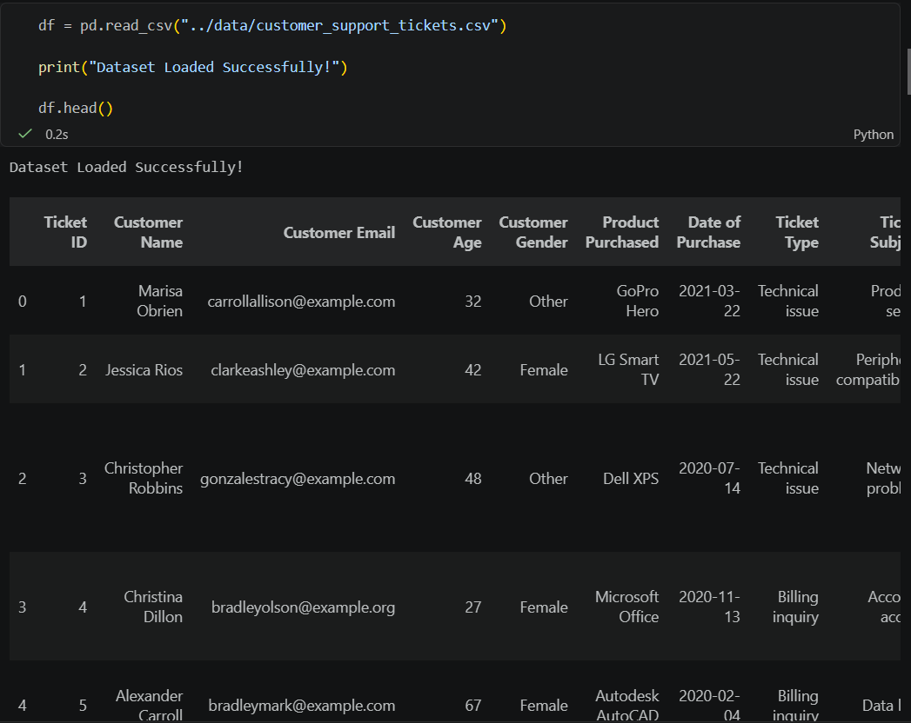
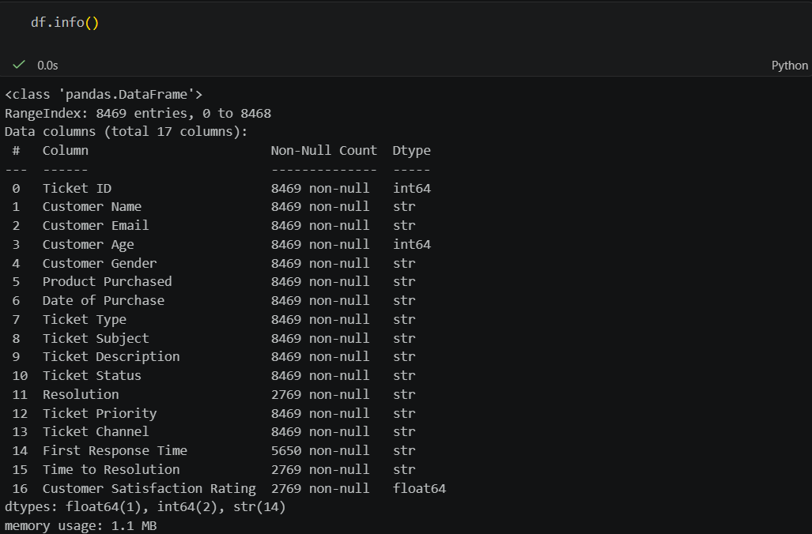
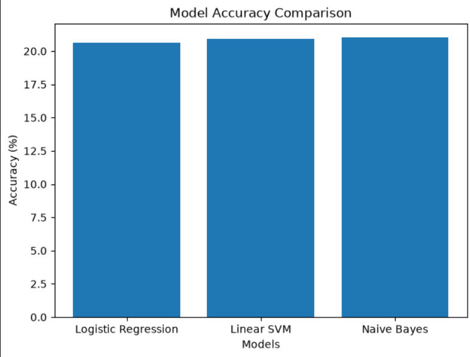
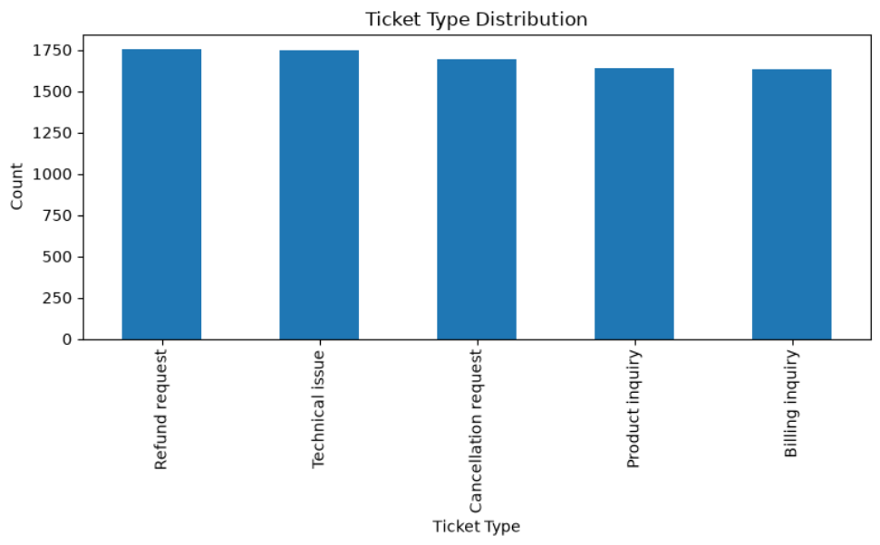
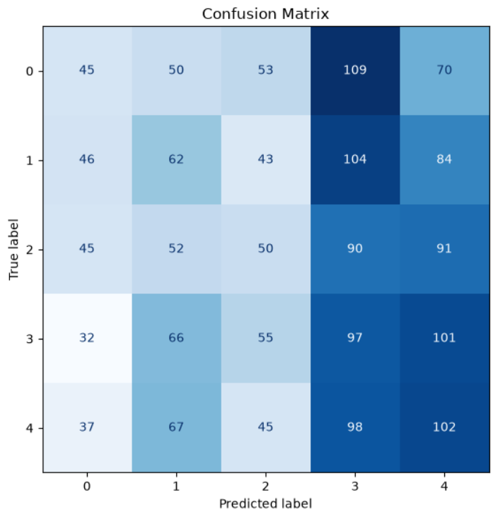
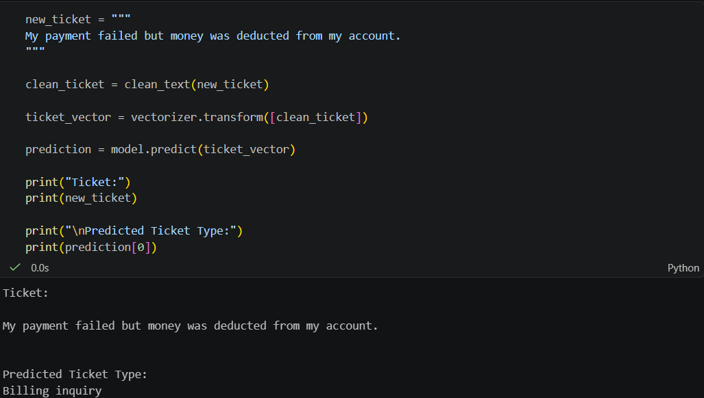
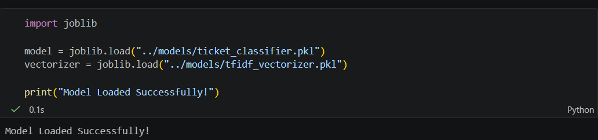

# 🎫 Customer Support Ticket Classification using Machine Learning

## 📌 Project Overview

This project classifies customer support tickets into different categories using Natural Language Processing (NLP) and Machine Learning algorithms.

The ticket text is preprocessed, converted into numerical features using TF-IDF Vectorization, and classified into one of the predefined ticket types.

---

## 🎯 Objective

To automatically predict the category of a customer support ticket based on its description, helping organizations route tickets efficiently.

---

## 📂 Dataset

Dataset: Customer Support Tickets

Target Column:
- Ticket Type

Features Used:
- Ticket Subject
- Ticket Description

---

## 🛠 Technologies Used

- Python
- Pandas
- NumPy
- Scikit-learn
- spaCy
- Matplotlib
- Joblib
- Jupyter Notebook

---

## 🔄 Project Workflow

1. Import Libraries
2. Load Dataset
3. Data Cleaning
4. Text Preprocessing using spaCy
5. Feature Extraction using TF-IDF
6. Train-Test Split
7. Train Machine Learning Models
8. Evaluate Accuracy
9. Compare Models
10. Save Model
11. Predict New Ticket Category

---

## 🤖 Machine Learning Models

- Logistic Regression
- Linear SVM
- Multinomial Naive Bayes

---

## 📊 Model Accuracy

| Model | Accuracy |
|--------|----------|
| Logistic Regression | 20.67% |
| Linear SVM | 20.90% |
| Naive Bayes | 21.02% |

Best Performing Model:
**Multinomial Naive Bayes**

---

## 📈 Output

The model predicts ticket categories such as:

- Billing Inquiry
- Product Inquiry
- Cancellation Request
- Refund Request
- Technical Issue

---

## 📁 Project Structure

```
FUTURE_ML_02
│
├── data/
│   └── customer_support_tickets.csv
│
├── models/
│   ├── ticket_classifier.pkl
│   └── tfidf_vectorizer.pkl
│
├── notebooks/
│   └── Support_Ticket_Classification_Final.ipynb
│
├── screenshots/
│   ├── accuracy_comparison.png
│   ├── confusion_matrix.png
│   ├── dataset_info.png
│   ├── dataset_preview.png
│   ├── folder_structure.png
│   ├── model_saved.png
│   ├── prediction.png
│   └── ticket_distribution.png
│
└── README.md
```

---

## 📷 Project Screenshots

### Dataset Preview



### Dataset Information



### Accuracy Comparison



### Ticket Distribution



### Confusion Matrix



### Prediction Output



### Model Saved



---

## 🚀 Future Improvements

- Improve model accuracy using advanced NLP techniques.
- Use BERT or Transformer-based models.
- Deploy the project using Flask or Streamlit.
- Build a web interface for real-time ticket classification.

---

## 👨‍💻 Author

**Name:** Anandarao

**Machine Learning Internship Task 02**

**Repository:** FUTURE_ML_02
